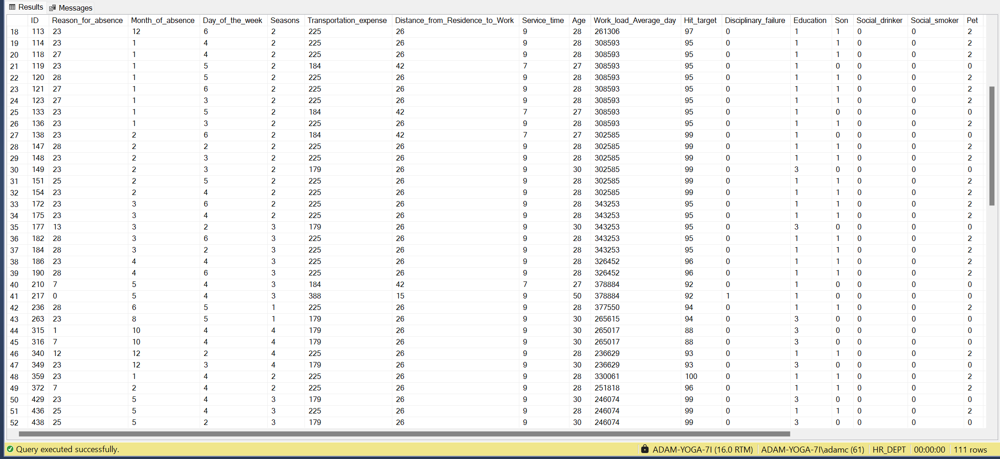
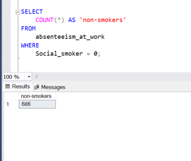
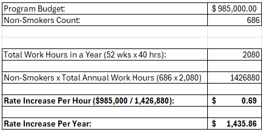
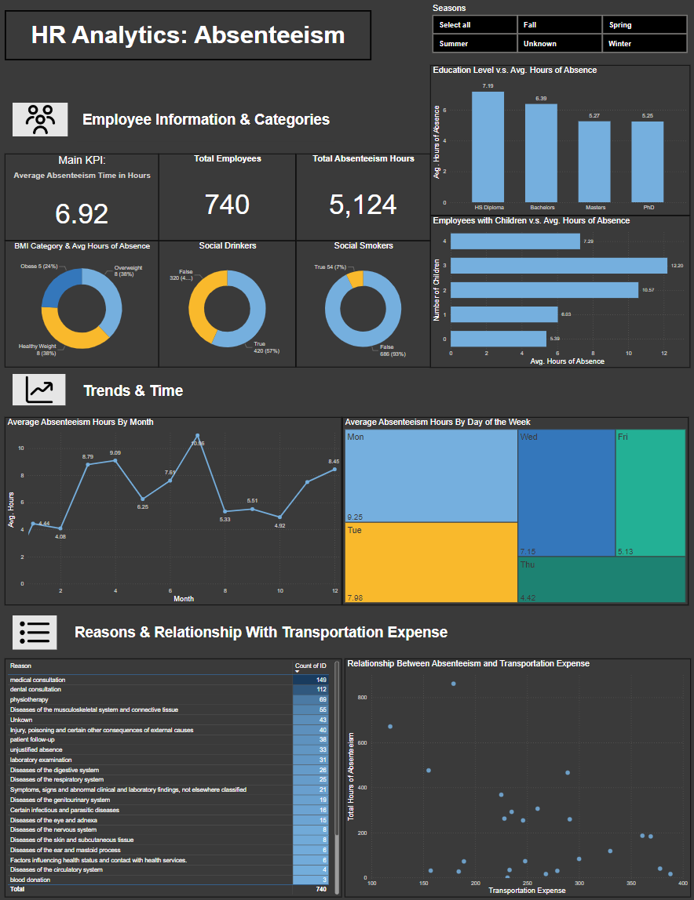

# Introduction
This project analyzes employee data from a human resources related database, particularly querying employee health information and absenteeism data to determine eligbility for programs providing bonuses. This project also provides insights into **employee absenteeism**, which is the main **key performance inidcator** in this analysis, and how different employee-related factors may affect it.

# Scenario
Human Resources department requests to the Data Analytics Team:
1. Provide a list of **Healthy Individuals and Low Absenteeism** for the company's Health Incentive Program.
  - Total program budget is **$50,000**
2. **Calculate a Wage Increase or Annual Compensation** for Non-Smokers.
  - Insurance budget of **$985,000 for all Non-Smokers**
3. **Build a Dashboard** for HR to understand **absenteeism** at work, as the main KPI, and how it might relate to different employee variables and look at trends over time.

# Tools Used
- ***SQL***: The core tool used for the analysis; writing SQL queries enabled filitering, joining and procuring relevant data from multiple tables in the HR database.
- ***Microsoft SQL Server + SSMS***: Utilized SSMS as the IDE to write and execute the SQL queries; also serves as the connection and interface to the MS SQL Server database.
- ***Power BI***: Popular visualization tool from Microsoft; used to construct the dashboard to understand absenteeism in the company.

# Analysis
### 1. Provide a list of **Healthy Individuals and Low Absenteeism** for the company's Health Incentive Program:
**Eligibility Requirements:**
- Non-Drinker
- Non-Smoker
- Body Mass Index **Less Than 25**
- Absenteeism Hours **Less Than the Average** of the Company

**SQL Code Query:**
```sql
SELECT
	*
FROM
	absenteeism_at_work
WHERE
	Social_drinker = 0
	AND Social_smoker = 0
	AND Body_mass_index < 25
	AND Absenteeism_time_in_hours < (
		SELECT
			AVG(Absenteeism_time_in_hours)
		FROM
			absenteeism_at_work)
ORDER BY
	ID;
```
#### List Of Healthy Employees


**Possible Actions:**
- Based on the list, there are a total of 111 eligible employees. The total budget could provide a $450 bonus for each of them.
- This data could be used to track the current healthy employees and monitor any changes of their health status.

### 2. **Calculate a Wage Increase or Annual Compensation** for Non-Smokers:
**SQL Code Query:**
```sql
SELECT
	COUNT(*) AS 'non-smokers'
FROM
	absenteeism_at_work
WHERE
	Social_smoker = 0;
```
#### Count of Non-Smokers

#### Wage Increase Calculation


**Possible Actions:** These employees who are non-smokers and are therefore eligible for the wage/compensation increase can receive around $0.69 per hour rate increase or $1,435.86 per year, based on the budget.

### 3. **Build a Dashboard** for HR to understand **absenteeism** at work, as the main KPI, and how it might relate to different employee variables and look at trends over time:
**SQL Code Query to Optimize Data for Dashboard:**
```sql
SELECT 
	a.ID,
	r.Reason,
	a.Body_mass_index,
	CASE
		WHEN a.Body_mass_index < 18.5 THEN 'Underweight'
		WHEN a.Body_mass_index BETWEEN 18.5 AND 25 THEN 'Healthy Weight'
		WHEN a.Body_mass_index BETWEEN 25 AND 30 THEN 'Overweight'
		WHEN a.Body_mass_index > 30 THEN 'Obese'
		ELSE 'Unknown'
	END AS BMI_Categeory,
	CASE
		WHEN a.Month_of_absence IN (12,1,2) THEN 'Winter'
		WHEN a.Month_of_absence IN (3,4,5) THEN 'Spring'
		WHEN a.Month_of_absence IN (6,7,8) THEN 'Summer'
		WHEN a.Month_of_absence IN (9,10,11) THEN 'Fall'
		ELSE 'Unknown'
	END AS Season_Names,
	a.Seasons,
	a.Month_of_absence,
	a.Day_of_the_week,
	CASE
		WHEN a.Day_of_the_week = 1 THEN 'Sun'
		WHEN a.Day_of_the_week = 2 THEN 'Mon'
		WHEN a.Day_of_the_week = 3 THEN 'Tue'
		WHEN a.Day_of_the_week = 4 THEN 'Wed'
		WHEN a.Day_of_the_week = 5 THEN 'Thu'
		WHEN a.Day_of_the_week = 6 THEN 'Fri'
		WHEN a.Day_of_the_week = 7 THEN 'Sat'
		ELSE 'Unknown'
	END AS Day_of_Week,
	a.Transportation_expense,
	CASE
		WHEN a.Education = 1 THEN 'HS Diploma'
		WHEN a.Education = 2 THEN 'Bachelors'
		WHEN a.Education = 3 THEN 'Masters'
		WHEN a.Education = 4 THEN 'PhD'
		ELSE 'Unknown'
	END AS Education_Level,
	a.Son AS 'Children',
	a.Social_drinker,
	a.Social_smoker,
	a.Pet,
	a.Disciplinary_failure,
	a.Age,
	a.Work_load_Average_day,
	a.Absenteeism_time_in_hours
FROM
	absenteeism_at_work a
LEFT JOIN compensation c
	ON a.ID = c.ID
LEFT JOIN reasons r
	ON a.Reason_for_absence = r.Number
ORDER BY
	a.ID;
```
### HR Dashboard Preview


**Possible Actions:**
- HR Staff can derive insights from this dashboard such as looking at employee categories and how they affect absenteeism on average.
  - Does education level of employees relate to how often they can be absent
  - Do employees with more children tend to have more absenteeism on average due external obligations possibly
  - Do health status or habits affect their ability to show up to work consistently
- HR Staff can also look at time-related trends like the overall average hours of absence per month and which days of the week typically have higher average length of absences.
- Lastly, they can look at the distribution of reasons for absences and if transportation expenses may have a hand in overall absenteeism.


